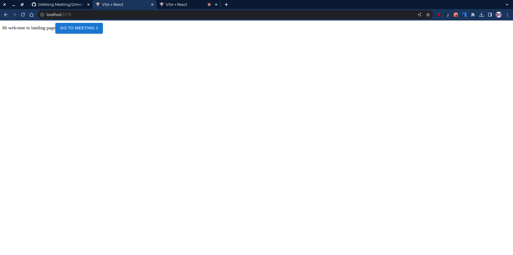

# Meeting

A WebRTC and WebSocket implementation using React, Material-UI, and Node.js

## Table of Contents
- [Overview](#overview)
- [Prerequisites](#prerequisites)
- [Getting Started](#getting-started)
  - [Client Side](#client-side)
  - [Server Side](#server-side)
- [Usage](#usage)
- [Features](#features)
- [Contributing](#contributing)

## Overview

This project is a demonstration of WebRTC and WebSocket implementation similar to Google Meet. The client side is built using React.js and Material-UI, while the server side is implemented in Node.js.

## Prerequisites

Before you begin, ensure you have the following installed:
- Node.js and npm 
- React.js
- Material-UI
- Socket.io

## Getting Started

### Client Side

1. Clone the repository and run client.

```bash
git clone https://github.com/leftover19/Meeting.git 
cd client
npm install
npm run dev 
```

client will run on ` http://localhost:5173/`
### Server Side

Navigate to the server directorr, install dependencies and start the server.

```bash
cd server
npm install
node index.js 
```
server will start on `http://localhost:3001/`

## Usage

To use the application, follow these steps:

1. Open the client-side application in your web browser.

2. On the landing page, you'll find a button labeled "Go to Meeting 1." Click on this button.



3. You will be redirected to the meeting page where you'll find a "Join Meeting 1" button.


4. Click on the "Join Meeting 1" button to enter the meeting.

5. Copy the url and paste in another tab and join the meeting.


## Features

Key features of this project include:

- **WebRTC Video Conferencing:** Enable real-time video conferencing within the application.
- **WebSocket Communication:** Utilize WebSocket for seamless and efficient communication.
- **Material-UI Interface:** Benefit from a responsive and modern UI powered by Material-UI components.


## Contributing

If you'd like to contribute to this project, feel free to create a pull request.

